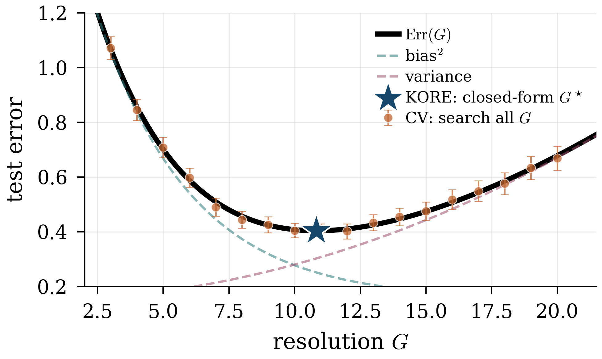
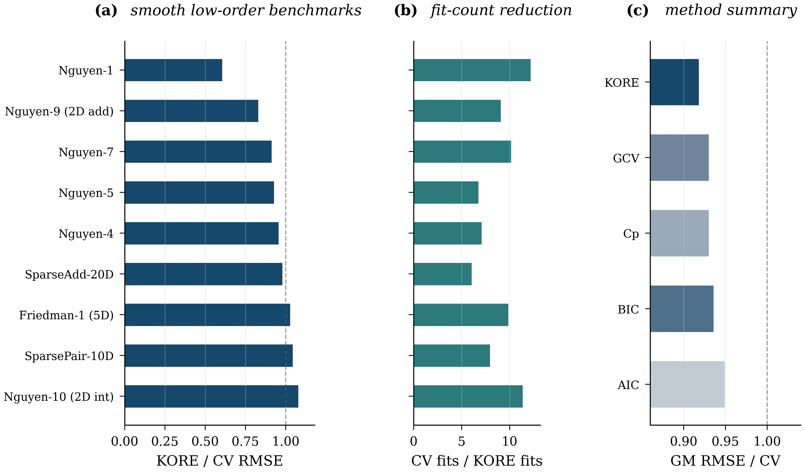
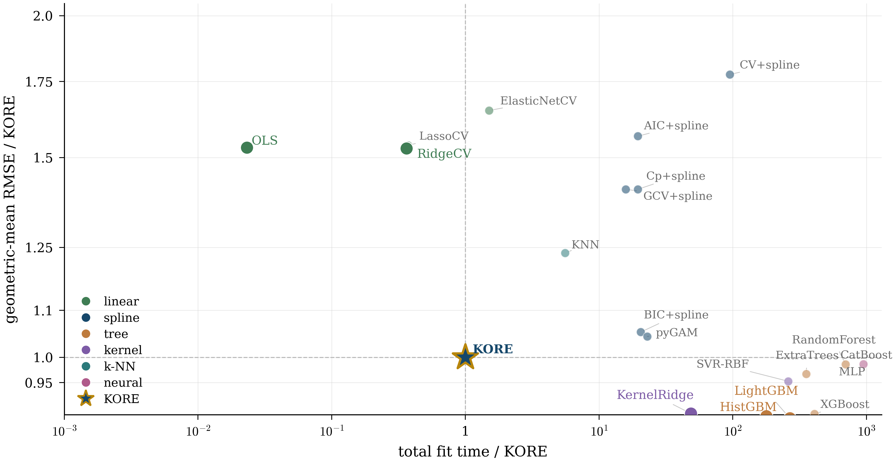

<p align="center">
  <h1 align="center">KORE</h1>
  <h3 align="center">Solve for the Hyperparameter, Skip the Search:<br>Kolmogorov-Optimal Scaling Laws for Spline Regression</h3>
  <p align="center">
    <a href="https://arxiv.org/abs/2606.23575"></a>
    <a href="https://opensource.org/licenses/MIT"></a>
    
  </p>
</p>

<p align="center">
  <strong>Yong Yi Bay</strong> &nbsp;&middot;&nbsp; <strong>Kathleen A. Yearick</strong><br>
  University of Illinois at Urbana-Champaign
</p>

---

<p align="center">
  
</p>

**KORE** (Kolmogorov-optimal Order-aware Resolution Estimation) replaces exhaustive cross-validation for spline hyperparameter selection with a closed-form plug-in. Instead of fitting dozens of models across a grid, KORE fits at just two resolutions, solves a leverage-calibrated 2x2 linear system for the bias and noise/variance constants, and obtains the optimal resolution analytically.

The "Kolmogorov-optimal" is literal. The spline family's bias decay `G^(-2 beta)` is the squared [Kolmogorov n-width](https://en.wikipedia.org/wiki/N-width) of the smoothness class, the best error any `n`-dimensional linear approximation can achieve; spline spaces of order `k+1` attain that rate, so they are width-optimal subspaces (Pinkus 1985). KORE never leaves that family: it only solves for *where* on the width-optimal bias-variance curve to sit.

**Key result:** On structured regression tasks up to 80 dimensions, KORE matches exhaustive 3-fold CV (and every standard closed-form alternative: GCV, Mallows' Cp, AIC, BIC) while using roughly **8x fewer model fits**.

## How it works

Standard hyperparameter tuning searches a grid:

> *Fit at G=1, G=2, ..., G=20, score each, pick the best.*

KORE solves instead of searching:

> 1. **Risk law** (paper, Section 3): the leave-one-out error tracks &nbsp; `LOO_f(G) ~ A_f * G^(-2 beta) + tau_f * n / (n - p_f(G))`, where `beta = k + 1` is the smoothness exponent and `p_f(G)` is the basis dimension at resolution `G`.
> 2. **Two fits** at resolutions `G_a` and `G_b` give two LOO error values via the PRESS identity (no refitting).
> 3. **Solve** the 2x2 leverage-calibrated system for the bias scale `A_f` and the noise/variance scale `tau_f`.
> 4. **Plug in** the closed-form root of the scalar derivative equation to obtain the continuous resolution `G_dagger`, round to the nearest stable integer, certify with a tiny LOO neighborhood.

The scaling law shows that the optimal resolution depends on *effective density* (`n/d` for additive models, `n/s` for sparse pairwise), not on ambient dimension. Double the features and double the data, and the optimal `G` stays put.

## Results

KORE is compared against **five baselines** that sweep the classical selection ladder: exhaustive 3-fold cross-validation (the accuracy gold standard), generalized cross-validation (GCV), Mallows' Cp, AIC, and BIC. The four closed-form criteria still evaluate the full candidate grid; KORE replaces the grid with a two-fit analytical solve.

<table>
<tr><th>Setting</th><th>KORE / CV RMSE</th><th>Fit reduction (vs CV)</th><th>Best baseline (GCV/Cp/AIC/BIC)</th></tr>
<tr><td>Frontier tasks (6 controlled)</td><td><strong>0.995</strong></td><td><strong>8.1x</strong></td><td>1.003 at 3.1x</td></tr>
<tr><td>Benchmarks (9 smooth equations)</td><td><strong>0.918</strong></td><td><strong>8.7x</strong></td><td>0.930 at 2.9x</td></tr>
<tr><td>Sparse pairwise (d=10,20,40,80)</td><td>1.000</td><td><strong>10.1x</strong></td><td>1.000 at 3.1x</td></tr>
</table>

KORE matches the accuracy ceiling set by the best classical criterion and delivers roughly 2.5x additional fit savings on top. A **degree ablation** at k in {2, 3, 5} further confirms that the closed-form plug-in resolution inherits the exact scaling exponent predicted by classical B-spline theory (`G_dagger ~ rho^(1/(2*beta+1))` with beta = k+1), not just the cubic case.

<p align="center">
  
</p>

## Real-world benchmark

A separate, conventions-driven validation pits KORE against twenty other tabular-regression baselines on the OpenML-CTR23 suite (Fischer et al. 2023) augmented with one additional UCI classic. The roster covers four linear baselines (OLS, RidgeCV, LassoCV, ElasticNetCV), the spline family (KORE, exhaustive CV, GCV, Mallows Cp, AIC, BIC, pyGAM), six tuned tree ensembles (RandomForest, ExtraTrees, HistGradientBoosting, XGBoost, LightGBM, CatBoost), two kernel methods (SVR-RBF, KernelRidge-RBF), KNN, and a small MLP. Hyperparameter search ranges for the tunable methods are lifted verbatim from Grinsztajn, Oyallon, Varoquaux 2022 NeurIPS Appendix B, with Optuna performing 20-trial Bayesian search and a 3-fold inner CV per trial. Results are reported as a Pareto frontier on `(geometric-mean RMSE vs KORE, total fit time across the suite)`, a per-dataset forest plot, and a paired Wilcoxon signed-rank significance test with Holm-Bonferroni correction. The experiment driver and figure generators are wired through `code/kore/experiments.py` and `code/kore/figures.py`; trigger the run with `uv run python -m kore.experiments real_data` after `uv sync --extra benchmark`.

<p align="center">
  
</p>

<p align="center">
  <em>KORE sits at the efficiency-accuracy elbow: the tuned boosters and the neural net buy a small relative-RMSE gain at two to three orders of magnitude more fit time, and the spline-grid selectors sit strictly above and to the right because they search the grid KORE solves in closed form.</em>
</p>

## Quick start

```bash
# 1. Install uv (https://docs.astral.sh/uv/) if you don't have it yet.
#    Do NOT use a global pip install; uv manages its own Python.
curl -LsSf https://astral.sh/uv/install.sh | sh

# 2. Clone this repo and sync the pinned environment from uv.lock.
#    uv sync also installs the local kore package, so `from kore import ...`
#    works inside the env. This gives bit-for-bit reproducibility of the
#    paper results.
git clone https://github.com/bay-yearick-lab/kore.git
cd kore
uv sync

# Run the full experiment suite or just the figure pass:
uv run python -m kore.experiments all
uv run python -m kore.figures
```

```python
from kore import auto_kore_intrinsic, make_dataset, make_additive_target

# Generate example data
target_fn = make_additive_target(d=10)
X_train, y_train, X_test, y_test, sigma = make_dataset(
    target_fn, n_train=1200, n_test=500, d=10, noise_frac=0.1, seed=42
)

# KORE: selects structure (additive vs pairwise) and resolution automatically
result = auto_kore_intrinsic(X_train, y_train)

print(f"Structure:  {result['structure']}")
print(f"Resolution: G = {result['G_star']}")
print(f"Total fits: {result['fits_total']}")
```

A drop-in scikit-learn estimator is also provided. `KORERegressor` follows the standard `fit` / `predict` / `score` / `get_params` / `set_params` contract, so it composes with `Pipeline`, `GridSearchCV`, and any other sklearn machinery:

```python
from kore import KORERegressor

model = KORERegressor().fit(X_train, y_train)
print(f"Structure: {model.structure_}, G = {model.G_star_}, R^2 = {model.score(X_test, y_test):.3f}")
```

`KOREAdditiveRegressor` and `KOREPairwiseRegressor` expose the additive-only and sparse-pairwise selectors respectively when the structure is known a priori.

## Reproducing the paper

All experiments use master seed `2026` for deterministic reproducibility.

```bash
# Run all experiments (uses all CPU cores)
uv run python -m kore.experiments all

# Generate all figures
uv run python -m kore.figures

# Compile the paper
cd paper && latexmk -pdf main
```

Individual experiments can be run separately:

```bash
uv run python -m kore.experiments law          # Effective-density collapse
uv run python -m kore.experiments frontier     # Accuracy-compute frontier (KORE vs CV, GCV, Cp, AIC, BIC)
uv run python -m kore.experiments benchmark    # Full 12-benchmark suite with the same 5-method ladder
uv run python -m kore.experiments discovery    # Graph discovery
uv run python -m kore.experiments robustness   # Robustness tests
uv run python -m kore.experiments scaling      # Dimension scaling
uv run python -m kore.experiments noise        # Noise sweep and applicability diagnostic
uv run python -m kore.experiments degree       # Degree ablation (k in {2, 3, 5})
uv run python -m kore.experiments consistency  # Plug-in consistency (Theorem 2)
uv run python -m kore.experiments real_data    # Real-world benchmark (36 datasets, 21 methods); needs `uv sync --extra benchmark`
```

Results are written to `results/` as CSV. Figures are written to `paper/figures/` as PDF and PNG. The real-world benchmark additionally caches each fetched dataset under `data/` (gitignored) so subsequent runs do not hit OpenML.

## Repository structure

```
pyproject.toml              uv-managed dependencies; ships the kore package.
build_paper.sh              Compile the paper with latexmk.
make_arxiv.sh               Assemble the self-contained arXiv submission tarball.
CITATION.cff                Citation metadata.
code/
  kore/
    __init__.py             Public API: auto_kore_intrinsic, kore_sande_additive,
                            kore_sande_pairwise, pilot_solve, closed_form_g_star,
                            make_dataset, make_additive_target, ...
    lib.py                  Core library: spline fitting, PRESS LOO, leverage-calibrated
                            pilot solve, closed-form G_dagger, additive selector, K-fold CV.
    intrinsic.py            Interaction-aware KORE: sparse pairwise design, structure
                            selection, graph discovery, classical full-grid baselines
                            (GCV / Cp / AIC / BIC).
    datasets.py             OpenML-CTR23 + UCI registry, cached fetchers, smooth-low-d
                            filter for the real-world benchmark.
    baselines.py            21 baselines for the real-world benchmark with uniform
                            fit(X, y, seed) interface and Grinsztajn-2022-cited search
                            spaces.
    experiments.py          Full experimental suite (parallelized, deterministic seeding);
                            CLI: `python -m kore.experiments <name|all>`.
    figures.py              Generates every publication figure from the CSV results;
                            CLI: `python -m kore.figures`.
  tests/                    Unit tests for the dispatch, instrumentation, and sklearn adapter.

paper/                      Self-contained arXiv submission.
  main.tex                  Paper source (LaTeX).
  main.pdf                  Compiled paper.
  main.bbl                  Pre-built bibliography (shipped for arXiv).
  references.bib            Bibliography source.
  kore.sty / kore.bst       Style and bibliography style.
  LICENSE                   CC BY 4.0 (paper text and figures).
  figures/                  Publication figures (PDF + PNG for every figure used in the paper).

results/                    Experimental results (CSV files, one per experiment driver).
data/                       OpenML/UCI dataset cache (gitignored).
```

## Citation

```bibtex
@article{bay2026kore,
  title         = {Solve for the Hyperparameter, Skip the Search: Kolmogorov-Optimal Scaling Laws for Spline Regression},
  author        = {Bay, Yong Yi and Yearick, Kathleen A.},
  year          = {2026},
  eprint        = {2606.23575},
  archivePrefix = {arXiv},
  primaryClass  = {cs.LG},
  doi           = {10.48550/arXiv.2606.23575}
}
```

## License

The source code (`code/`, `build_paper.sh`, `make_arxiv.sh`) is released under the
MIT License ([LICENSE](LICENSE)). The paper text and figures (`paper/`) are licensed
under CC BY 4.0 ([paper/LICENSE](paper/LICENSE)).
